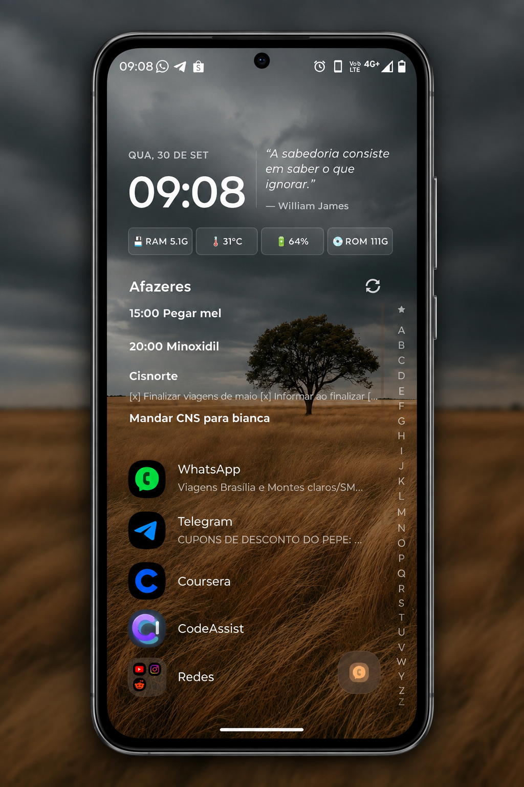
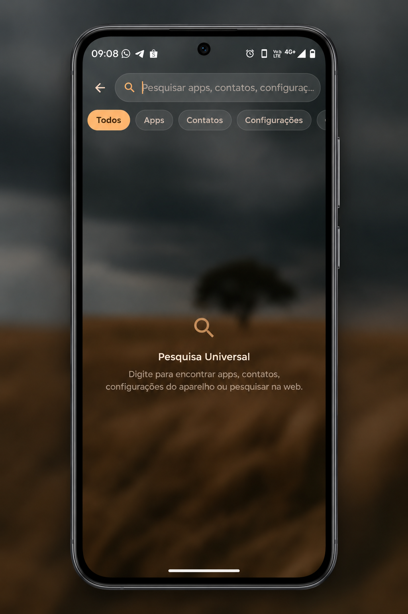
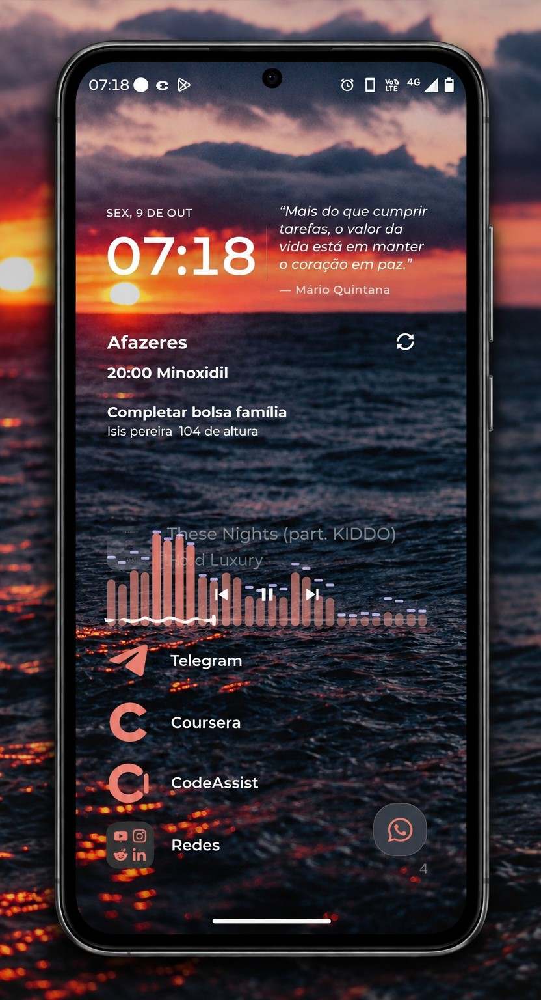
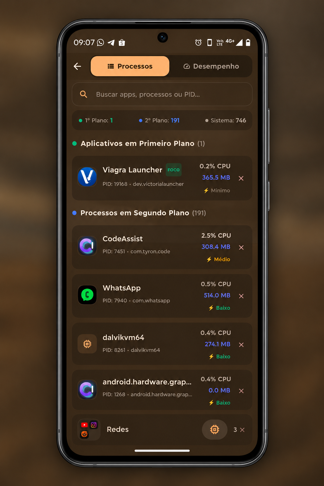
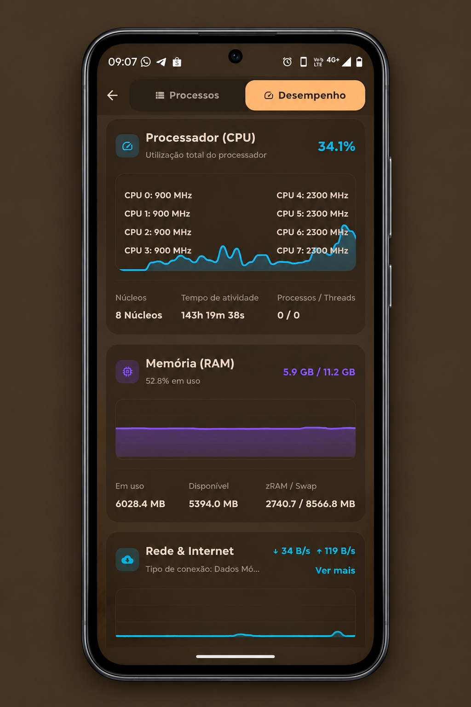
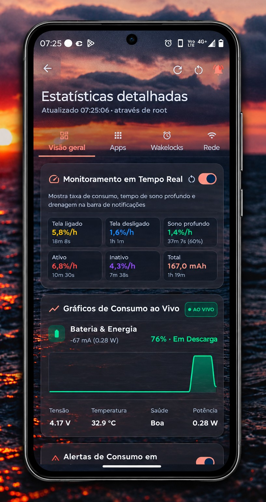

# Viagara Launcher

Launcher minimalista para Android baseado em lista vertical, inspirado no [Niagara Launcher](https://niagaralauncher.app).

  
  
  
  
  
  

---

##   Destaques / Features

- **Ergonomia com Uma Mão:** Lista vertical rápida e scrubber alfabético com acesso instantâneo aos favoritos.
- **Catálogo Oficial de Wallpapers:** Papéis de parede em alta definição (OLED, Espaço, Natureza, Abstrato e Minimalista) com aplicação direta e atualizações automáticas.
- **Temas & Cores Dinâmicas:** Material You integrado, OLED Preto Puro e adaptação imediata às cores do wallpaper.
- **Notificações Integradas:** Prévias sob os apps e pop-up expansível translúcido com histórico de mensagens.
- **Widgets & Now Playing:** Suporte a widgets do Android e controle multimídia na tela inicial.
- **Customização:** Ícones temáticos, suporte a icon packs externos, ocultação de apps e pastas.
- **Atualizador Embutido:** Download e verificação de novidades diretamente pelo app via GitHub Releases.

---

##   Recursos para Superusuário

*(Ferramentas extras para usuários avançados; o launcher funciona 100% sem root)*

- **Gerenciador de Processos:** Inspeção detalhada de memória/CPU e encerramento forçado de processos em segundo plano.
- **Monitor de Desempenho:** Acompanhamento de taxas de uso de hardware em tempo real.
- **Diagnóstico do Sistema:** Análise profunda de bateria (`batterystats`), rastreamento de anomalias e visualizador de crashes.

---

##   Download

Baixe o APK da versão mais recente na aba **[Releases](https://github.com/S-Marcos-S/viagra-launcher/releases)**.

> Requer Android 8.0 (API 26) ou superior.

---

##   Créditos / Credits

- **[Niagara Launcher](https://niagaralauncher.app)** — Inspiração do conceito ergonômico em lista vertical.
- **[Wallhaven](https://wallhaven.cc)** e seus artistas — Coleção oficial de papéis de parede.
- **[LogFox](https://github.com/F0x1d/LogFox)** — Sistema de captura de logs e diagnóstico.
- **[BatStats](https://github.com/mlm-games/BatStats)** — Telemetria e análise de bateria.

---

##   Licença / License

[GPL-3.0-or-later](LICENSE)
